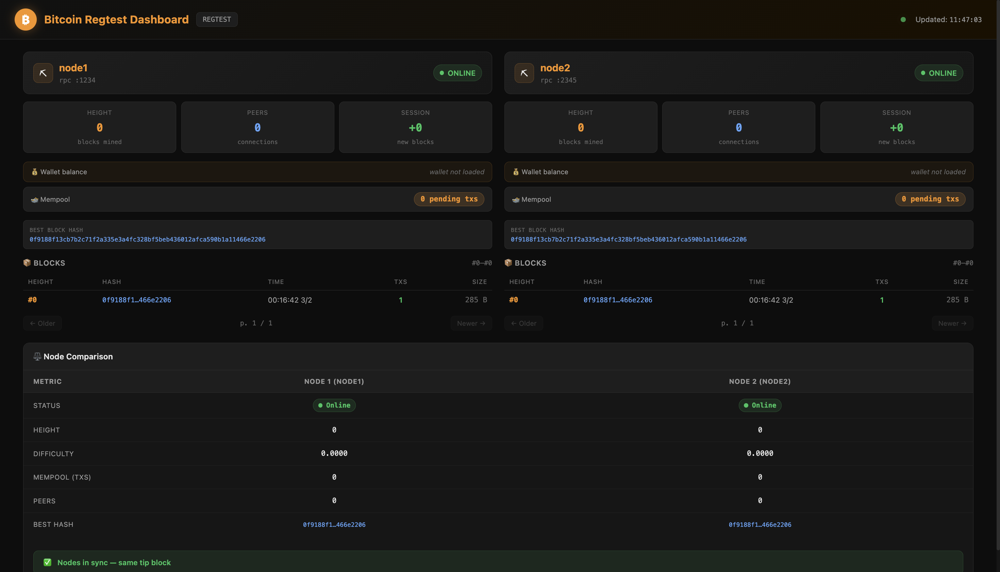
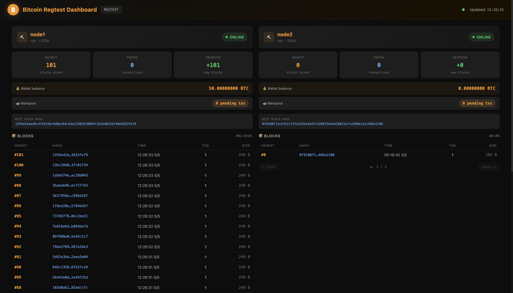
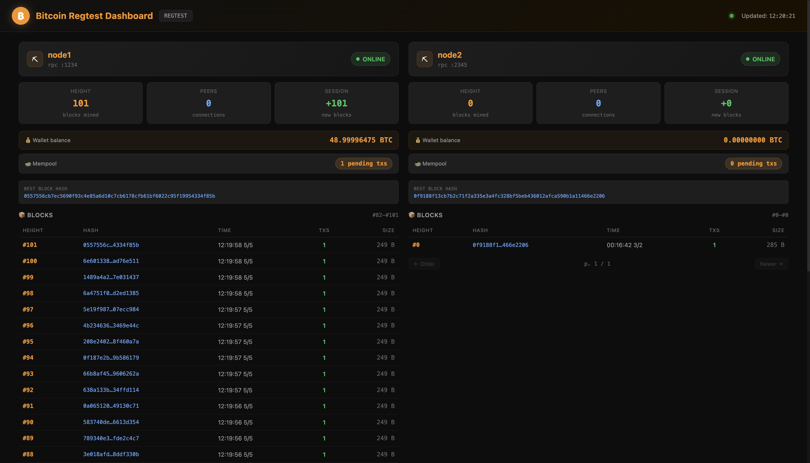
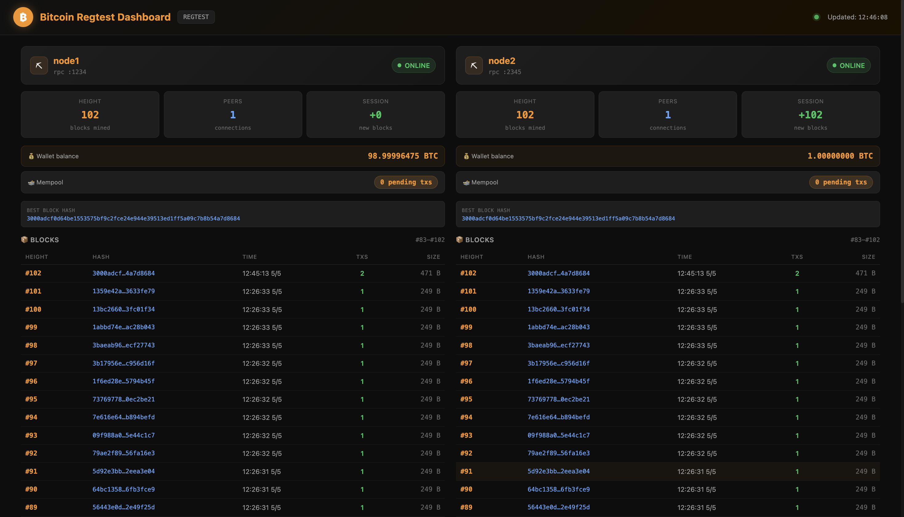
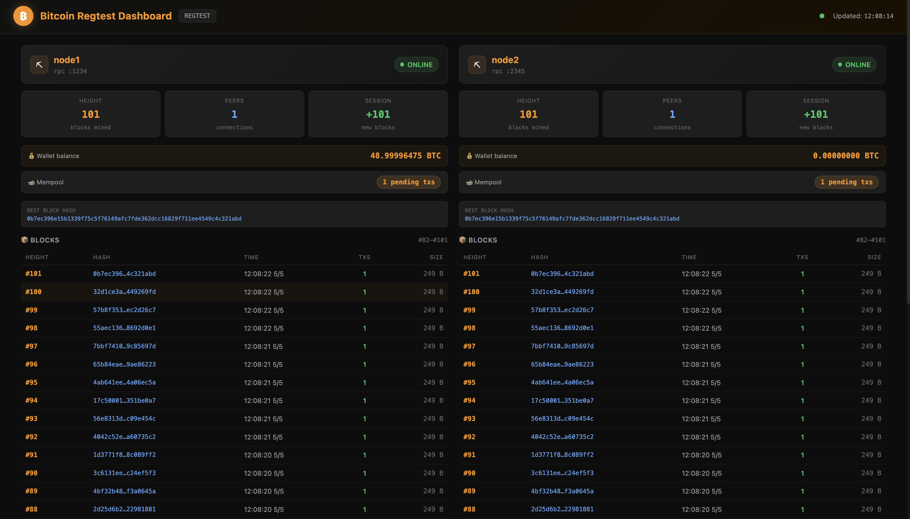
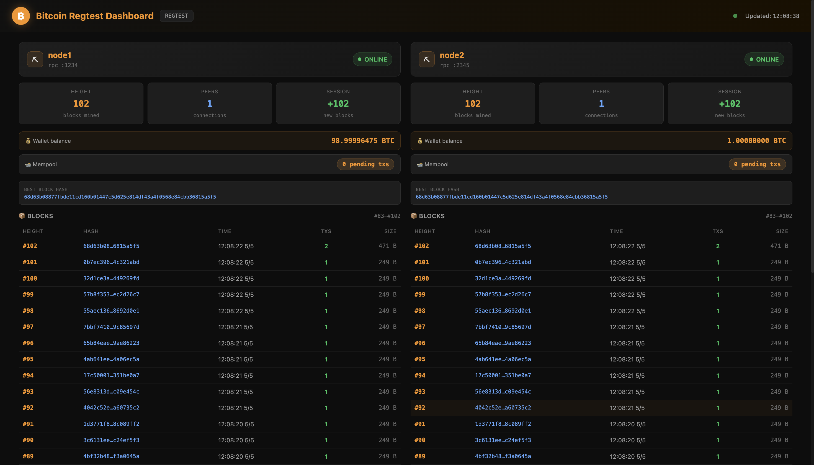
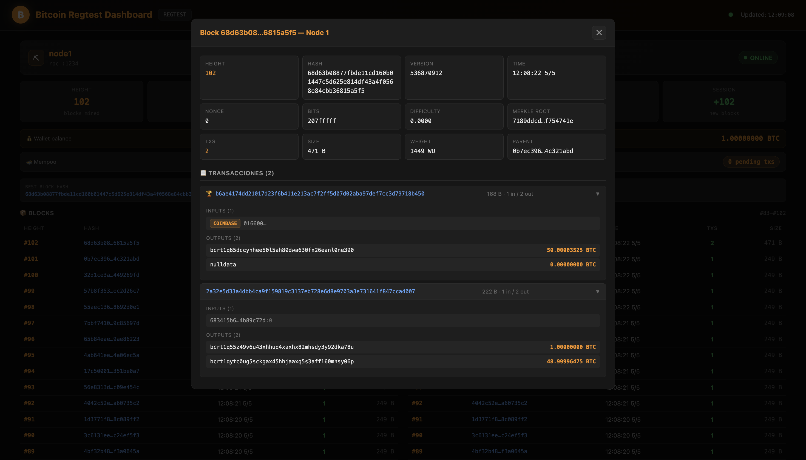

# Bitcoin Regtest Dashboard

A real-time web dashboard to monitor two Bitcoin nodes running in **regtest** mode. Visualizes blocks, transactions, mempool and network status — all from a single browser tab.

Built as part of the **[AFI Master in Data Science & AI](https://www.afiglobaleducation.com/master-fulltime/master-en-ciencia-de-datos-e-inteligencia-artificial) — Blockchain Analytics** practical workshop.

---

## What is this?

When developing or testing Bitcoin applications, you typically run local nodes in `regtest` mode — a private blockchain where you control everything. This project gives you two things:

**A live dashboard** that monitors both nodes side by side: block explorer with clickable transactions, wallet balances, mempool monitoring, paginated block history, and real-time sync status — all updated automatically without page refresh.

**A set of bash scripts** to install Bitcoin Core, start and connect the nodes, mine blocks, send transactions between wallets, and run two end-to-end demo scenarios:

- **Standalone demo** — node1 mines independently while node2 stays isolated. After running the demo you can see both nodes on completely separate chains (different heights, different tip hashes, different balances). Then you connect them as peers and watch node2 sync automatically, adopting node1's longer chain — a direct illustration of Bitcoin's consensus rule: *nodes always adopt the longest valid chain*.

- **Full demo** — both nodes are connected from the start. Every mined block propagates to both peers in real time, so both nodes stay in sync throughout. At the end you can inspect the last block containing two transactions: the coinbase (mining reward) and the payment from node1 to node2, with its change output back to node1.

---

## Architecture

```
~/bitcoin/
├── node1/   ← Bitcoin Core node 1  (RPC port 1234)
└── node2/   ← Bitcoin Core node 2  (RPC port 2345)

bitcoin-dashboard/
├── server.py              ← Python HTTP API server (port 18500)
├── index.html             ← Single-page dashboard (served via server.py)
├── start-dashboard.sh     ← Start dashboard server + open browser
├── stop-dashboard.sh      ← Stop dashboard server
└── scripts/
    ├── install-mac.sh       ← Install Bitcoin Core on macOS
    ├── install-linux.sh     ← Install Bitcoin Core on Linux / WSL2
    ├── start-nodes.sh       ← Start both bitcoind processes
    ├── stop-nodes.sh        ← Stop both bitcoind processes
    ├── connect-nodes.sh     ← Connect node1 ↔ node2 as peers
    ├── demo-standalone.sh   ← Standalone demo: node1 mines independently (nodes isolated)
    ├── demo-full.sh         ← Full demo: wallets, mining, transaction (nodes connected)
    ├── send-transaction.sh  ← Send N BTC between nodes (broadcast only)
    └── mine-blocks.sh       ← Mine N blocks on a given node
```

```
Browser  ──fetch──▶  server.py :18500  ──JSON-RPC──▶  bitcoind :1234
                                       ──JSON-RPC──▶  bitcoind :2345
```

**Why a backend server?** Browsers block direct RPC calls from a web page due to CORS and security policies. `server.py` acts as a local proxy, forwarding requests from the dashboard to each node using cookie-based authentication (`.cookie` files generated automatically by Bitcoin Core).

---

## Requirements

- **macOS** or **Linux** (Ubuntu/Debian, including WSL2 on Windows 11)
- **Bitcoin Core** (installed via the scripts below)
- **Python 3.9+** (no external dependencies — stdlib only)
- **Homebrew** (macOS only — https://brew.sh)

---

## Step-by-step guide

Start by making all scripts executable — run this once from the project folder:

```bash
chmod +x start-dashboard.sh stop-dashboard.sh scripts/*.sh
```

---

### Step 1 — Install Bitcoin Core

**macOS:**
```bash
./scripts/install-mac.sh
```

This runs `brew install bitcoin` and creates the `~/bitcoin/node1` and `~/bitcoin/node2` directories.

**Linux / WSL2:**
```bash
./scripts/install-linux.sh
source ~/.bashrc   # reload PATH
```

This downloads Bitcoin Core 27.2, extracts it to `~/bitcoin-core`, adds it to your PATH, and creates the node directories.

> **Manual alternative:** Download the right binary for your platform from https://bitcoin.org/en/download

---

### Step 2 — Start the Bitcoin nodes

```bash
./scripts/start-nodes.sh
```

This starts two `bitcoind` processes in regtest mode, each with its own data directory and ports:

| Node  | P2P port | RPC port | Data directory        |
|-------|----------|----------|-----------------------|
| node1 | 1235     | 1234     | `~/bitcoin/node1`     |
| node2 | 2346     | 2345     | `~/bitcoin/node2`     |

> **Tip:** Open two extra terminal tabs running `tail -f ~/bitcoin/node1/regtest/debug.log` and `tail -f ~/bitcoin/node2/regtest/debug.log` to see live node activity throughout the exercise.

---

### Step 3 — Start the dashboard

```bash
./start-dashboard.sh
```

This starts `server.py` on port 18500 and opens `http://localhost:18500` in your browser.

**Check the initial state in the dashboard:** both nodes should appear online with height 0, 0 peers, mempool empty and wallet balance at 0 BTC. This is the starting point — a clean private blockchain with no activity yet.



> **Want to generate this dashboard with AI?** See [`website_prompt.md`](website_prompt.md) for the full prompt used to build it with Claude.

---

### Step 4 — Run the demo

Two modes are available depending on what you want to demonstrate.

#### Option A — Standalone demo (nodes isolated)

Runs the full exercise on **node1 only**, without connecting the nodes as peers first.

```bash
./scripts/demo-standalone.sh
```

The script runs automatically — no need to type any commands while it runs. It **pauses at two points** for you to explore the dashboard.

**First pause — before the transaction (101 blocks mined):**

The script stops after mining 101 blocks and asks you to check the dashboard. Switch over and verify:



- node1 shows **101 blocks** mined; node2 shows **height 0** — it has never received any blocks
- Wallet balance: node1 shows **50 BTC**, node2 shows **0 BTC**
- Mempool: **0 pending transactions** on both nodes — nothing has been sent yet
- Comparison panel (bottom): nodes are **OUT OF SYNC** — different heights, different tip hashes, sync indicator red — the nodes have never been connected as peers

Press Enter in the terminal to send the transaction.

**Second pause — transaction in the mempool:**

The script broadcasts 1 BTC from node1 to node2, then pauses again. Switch to the dashboard and check:



- The **mempool counter** on node1 shows **1 pending transaction**; node2 shows **0** — it has not seen the transaction because the nodes are not connected
- **Wallet balances have not changed yet** — the transaction exists but has not been confirmed
- node2 still shows height 0

Press Enter in the terminal when ready to mine the confirmation block.

**After the script finishes:**

The script mines 1 block and shows the final balances in the terminal. Switch to the dashboard and verify:


- Mempool is now **empty** (0 pending transactions)
- A new block has appeared at the top of node1's block list at height **102** with **2 transactions** — click on it to see the **coinbase** (block reward) and the **1 BTC payment** from node1 to node2
- Wallet balances: node1 shows **~49 BTC** (50 − 1 sent − fee), node2 still shows **0 BTC** — it has received nothing because the nodes are not connected
- Comparison panel: still **OUT OF SYNC** — node2 remains at height 0

**Connecting the nodes (the key moment):**

Now run:

```bash
./scripts/connect-nodes.sh
```

Watch the dashboard — within a few seconds you will see node2 sync automatically:



- node2's height **jumps from 0 to 102** — it has adopted node1's longer chain in full
- Both nodes show **1 peer** (each other)
- node2's wallet balance updates to **1 BTC** — it has now processed the transaction that node1 broadcast earlier
- Both nodes show the **same block list** with identical hashes and the same block #102 with 2 transactions at the top
- Comparison panel: sync indicator turns **green** — both nodes share the same tip block hash

This is Bitcoin's core consensus rule in action: **nodes always adopt the longest valid chain**. node2 had no choice — when it connected to node1 and discovered a chain 102 blocks longer than its own (which had 0), it discarded its state and downloaded node1's entire chain.

---

#### Option B — Full demo (nodes connected from the start)

Runs the complete exercise with both nodes connected as peers from the beginning. Every block mined on node1 propagates to node2 in real time.

```bash
./scripts/demo-full.sh
```

The script runs automatically and **pauses once** — when the transaction is in the mempool — for you to explore the dashboard.

**Pause — transaction in the mempool:**

The script broadcasts 1 BTC from node1 to node2, then pauses. Switch to the dashboard and check:



- The **mempool counter** shows **1 pending transaction on both nodes** — unlike the standalone demo, node2 is connected and receives the transaction immediately
- **Wallet balances have not changed yet** — the transaction has not been confirmed
- Both nodes show the same height (**101 blocks**) and the same tip hash

Press Enter in the terminal when ready to mine the confirmation block.

**After the script finishes:**

The script mines 1 block and shows the final balances. Switch to the dashboard and verify:



- Mempool is now **empty** on both nodes
- Both nodes show **102 blocks** and the same tip hash — the sync indicator is **green**
- Wallet balances: node1 shows **~49 BTC**, node2 shows **1 BTC**

Find the block at height **102** in node1's block list — it shows **2 transactions** (TXS column). Click on it to open the block detail:



The modal shows all block header fields and both transactions: the **coinbase** (the mining reward created automatically in every block) and the **payment** (1 BTC sent to node2's address, with the change returning to node1). Expand each transaction to inspect its inputs and outputs.

**Comparison panel:** both nodes show the same height and the same tip block hash — the sync indicator is green. Every block propagated to both peers immediately throughout the demo.

---

### Step 4b — Send a transaction manually

Once the nodes have funds (after running either demo), you can send transactions between them at any time.

**Phase 1 — Broadcast the transaction**

```bash
# Send 1 BTC from node1 to node2
./scripts/send-transaction.sh 1 1 2

# Send 0.5 BTC from node2 to node1
./scripts/send-transaction.sh 0.5 2 1
```

The script broadcasts the transaction and then **pauses**, waiting for you to press Enter. While it waits, switch to the dashboard and check:

- The **mempool counter** shows 1 pending transaction.
- The **wallet balances** have not changed yet — the transaction exists in the mempool but has not been included in any block.

This is the unconfirmed state: the transaction is known to the network but not yet final. When you are done exploring, press Enter in the terminal. The script will print instructions for the next step and exit.

**Phase 2 — Mine a block to confirm**

```bash
./scripts/mine-blocks.sh 1 1
```

**Phase 3 — Verify in the dashboard**

Switch back to the dashboard and check:

- The **mempool** is now empty — the pending transaction has been picked up by the miner.
- A **new block** has appeared at the top of node1's block list. Click on it to expand: it contains 2 transactions — the coinbase (mining reward) and the confirmed payment. Inspect the inputs and outputs of each.
- The **wallet balances** have updated: the sender's balance decreased by the sent amount plus the fee, and the receiver's balance increased accordingly.

---

### Step 5 — Stop everything

```bash
# Stop the dashboard
./stop-dashboard.sh

# Stop the Bitcoin nodes
./scripts/stop-nodes.sh
```

Or individually:
```bash
bitcoin-cli -regtest -datadir=$HOME/bitcoin/node1 -rpcport=1234 stop
bitcoin-cli -regtest -datadir=$HOME/bitcoin/node2 -rpcport=2345 stop
```

---

## Dashboard features

### Per-node panels
| Feature | Description |
|---|---|
| **Status badge** | Online / Offline indicator |
| **Chain height** | Current block count |
| **Peers** | Number of connected peers |
| **Session blocks** | Blocks mined since dashboard opened |
| **Mempool** | Pending transaction count, refreshed every 10s |
| **Best block hash** | Full hash of the chain tip |

### Block list
- Last 20 blocks, newest first
- Columns: height · hash · timestamp · tx count · size
- **Click any block** to open the detail modal

### Block detail modal
- All block header fields: version, merkle root, bits, nonce, difficulty, weight
- Full transaction list — each transaction expandable showing:
  - All inputs (coinbase or `txid:vout`)
  - All outputs with address and BTC value

### Real-time updates
| Data | Polling interval |
|---|---|
| Node info (height, peers) | Every 3 seconds |
| Block list | Every 5 seconds |
| Mempool | Every 10 seconds |

New blocks flash orange when detected.

### Comparison panel
- Side-by-side table comparing both nodes
- Sync indicator: green if both nodes share the same tip block hash

---

## API endpoints

`server.py` exposes a local JSON API at `http://localhost:18500`:

| Endpoint | Description |
|---|---|
| `GET /` | Serves `index.html` |
| `GET /api/status` | Connection status of both nodes |
| `GET /api/node/{1\|2}/info` | `getblockchaininfo` + `getnetworkinfo` + `getmempoolinfo` |
| `GET /api/node/{1\|2}/blocks` | Last 20 blocks (summary) |
| `GET /api/node/{1\|2}/block/{hash}` | Full block with transactions (verbosity 2) |
| `GET /api/node/{1\|2}/mempool` | Mempool info + raw txid list |

---

## Configuration

Node config is at the top of `server.py`. Change ports or paths here if your setup differs:

```python
NODE_CONFIGS = [
    {"name": "node1", "rpchost": "127.0.0.1", "rpcport": 1234, "datadir": BITCOIN_DIR / "node1"},
    {"name": "node2", "rpchost": "127.0.0.1", "rpcport": 2345, "datadir": BITCOIN_DIR / "node2"},
]
```

Authentication uses Bitcoin Core's auto-generated `.cookie` files — no manual credential setup needed.

---

## Frequently asked questions & common errors

### Getting started

**"I get `No such file or directory` when running the `chmod` command"**

You are running the command from the wrong folder. The terminal must be inside the `bitcoin-dashboard` directory — the folder you cloned or downloaded. Run `pwd` to see where you are, then navigate to the right place:

```bash
cd ~/path/to/bitcoin-dashboard
chmod +x start-dashboard.sh stop-dashboard.sh scripts/*.sh
```

**"What does `./` mean before a script name?"**

It tells the terminal to run the script located in the current folder. Without it, the terminal searches only in system-wide locations and won't find the script. Always include `./` when running scripts from this project.

**"I get `Permission denied` when running a script"**

The script is not marked as executable. Run the `chmod` command from the beginning of the guide:

```bash
chmod +x start-dashboard.sh stop-dashboard.sh scripts/*.sh
```

---

### Step 1 — Installation

**"I get `brew: command not found` when running `install-mac.sh`"**

Homebrew is not installed on your Mac. Install it first by visiting https://brew.sh and pasting the one-line command shown there into your terminal. Once done, run `./scripts/install-mac.sh` again.

**"The install script says `Warning: bitcoin X.X is already installed` — did it work?"**

Yes. This message means Bitcoin Core was already installed from a previous session. The script still creates the `~/bitcoin/node1` and `~/bitcoin/node2` directories if they don't exist. You can continue to Step 2.

**"On Linux, `bitcoind` is not found even after running `install-linux.sh`"**

You need to reload your shell so the PATH update takes effect. Run:

```bash
source ~/.bashrc
```

If that doesn't work, close the terminal completely and open a new one. If you installed in a previous session and opened a fresh terminal, you need to run `source ~/.bashrc` every time — or log out and back in once so the change becomes permanent.

**"I'm on Windows — can I follow this guide?"**

Only through WSL2 (Windows Subsystem for Linux 2). Install WSL2 from the Microsoft Store (search for "Ubuntu"), open an Ubuntu terminal, and follow the Linux instructions. Native Windows terminals (PowerShell, CMD) are not supported.

---

### Step 2 — Starting the nodes

**"I get `bitcoind: command not found` when running `start-nodes.sh`"**

Bitcoin Core is not installed or not in your PATH. On macOS, run Step 1 first. On Linux/WSL2, make sure you ran `source ~/.bashrc` after installing. Verify it works by typing `bitcoind --version` in the terminal.

**"The script says `⚠️ node1 already running — skipping` — is that a problem?"**

No. This means the node was already running from a previous session and the script detected it correctly. You can continue to Step 3.

**"The script gets stuck on `Waiting for nodes to be ready...` and never finishes"**

The nodes are taking too long to start, or they failed silently. Press Ctrl+C to stop the script. Then check whether bitcoind actually started:

```bash
ps aux | grep bitcoind
```

If no processes appear, look at the log for errors:

```bash
tail -20 ~/bitcoin/node1/regtest/debug.log
```

**"I see `bind: Address already in use` in the output or logs"**

A previous bitcoind process is still running on those ports. Stop it first and wait a few seconds before restarting:

```bash
./scripts/stop-nodes.sh
./scripts/start-nodes.sh
```

---

### Step 3 — Dashboard

**"I ran `./start-dashboard.sh` but the browser didn't open automatically"**

Open your browser manually and go to http://localhost:18500. The dashboard is served there.

**"The dashboard shows both nodes as OFFLINE"**

The Bitcoin nodes are not running. Go back to Step 2 and run `./scripts/start-nodes.sh`. Keep the dashboard tab open — it polls automatically every 3 seconds and will update on its own once the nodes are up.

**"I get `Address already in use` error or the dashboard doesn't load"**

A previous session's server is still running on port 18500. Stop it first:

```bash
./stop-dashboard.sh
```

Then start again with `./start-dashboard.sh`. If `stop-dashboard.sh` says the file is missing, kill the process directly:

```bash
pkill -f server.py
./start-dashboard.sh
```

**"The wallet balance shows `—` or `wallet not loaded`"**

No wallet has been created yet. Wallets are created automatically when you run one of the demo scripts in Step 4. This is expected if you haven't run a demo yet.

**"Node 1 shows height 0 and 0 BTC — I thought it was running"**

A running node doesn't have any blocks or funds until you mine them. The starting state of a clean regtest blockchain is height 0, 0 peers, empty mempool, 0 BTC. This is correct. Run the demo (Step 4) to generate activity.

---

### Step 4 — Demos

**"The demo script fails immediately with `Connection refused` or RPC errors"**

The nodes are not running. Demo scripts require both bitcoind processes to be active. Run `./scripts/start-nodes.sh` and wait for the "Both nodes ready!" message before running the demo.

**"The demo says `wallet1 already exists` — did something go wrong?"**

No. This happens when you run the demo a second time without resetting. The script detects the existing wallet and continues normally. If you want a completely fresh start, stop the nodes and delete the data directories, then restart:

```bash
./scripts/stop-nodes.sh
rm -rf ~/bitcoin/node1 ~/bitcoin/node2
./scripts/start-nodes.sh
```

**"After the standalone demo, node2 shows 0 BTC — but node1 sent it 1 BTC. Did the transaction fail?"**

No — this is the key insight of the standalone demo. The two nodes are running **completely separate blockchains** because they have never been connected as peers. Node2 has never seen the transaction that node1 broadcast, because no one told it about it. This is intentional. To complete the exercise, run:

```bash
./scripts/connect-nodes.sh
```

Then watch the dashboard: node2 will detect that node1 has a longer valid chain and sync automatically — its height will jump from 0 to 102 and its balance will update to 1 BTC. This is Bitcoin's core consensus rule in action: nodes always adopt the longest valid chain.

**"After connecting the nodes, node2 still shows height 0"**

Sync takes a few seconds. The dashboard refreshes every 3 seconds — wait a moment and the values will update automatically. If nothing changes after 30 seconds, check that both nodes show a green Online badge in the dashboard.

**"After the standalone demo, node2 shows 0 peers even after connecting"**

The `connect-nodes.sh` script establishes a one-time connection. The peer count refreshes every 3 seconds in the dashboard. If after 10 seconds the peer count is still 0, run the connect script again — sometimes the first `addnode` call needs a moment to take effect.

---

### Step 4b — Sending transactions manually

**"I get an error like `Insufficient funds` or the script exits with a balance warning"**

The script checks the balance before sending. You are trying to send more BTC than the wallet holds. Check the current balance in the dashboard and use a smaller amount. Remember that each transaction also deducts a small fee, so you can never send the exact full balance.

**"The mempool showed 1 pending transaction for just a moment and then disappeared"**

The send script broadcasts the transaction but does not mine automatically — you need to run `./scripts/mine-blocks.sh 1 1` yourself. If the mempool emptied on its own, a previous block may have been mined by another process.

---

### General questions

**"What is regtest mode? Is this real Bitcoin?"**

No. Regtest (regression test) mode is a private, local blockchain that only exists on your own computer. No real money is involved — the BTC you mine and send has no value outside this exercise. You can mine blocks instantly on demand, reset everything by deleting the data directories, and experiment freely. It is the standard environment for learning and developing Bitcoin applications.

**"What is a coinbase transaction? I see one in every block"**

The coinbase is the first transaction in every block. Unlike regular transactions it has no inputs — it creates new Bitcoin out of thin air as the reward for mining the block. In regtest mode the reward is 50 BTC per block (the same as Bitcoin's earliest days in 2009). It is the only way new Bitcoin enters circulation. Every block must contain exactly one coinbase.

**"Why does the demo mine 101 blocks before sending? Why not just 1?"**

Bitcoin has a rule that freshly mined coins (coinbase outputs) cannot be spent until the block containing them has at least 100 blocks mined on top of it — this is called the **coinbase maturity rule**. It protects against chain reorganizations: if a block were orphaned (replaced by a competing chain), its coinbase would become invalid. After 100 confirmations that risk is negligible. So the demo mines 1 block to earn 50 BTC, then 100 more blocks to make those coins spendable, and only then sends the transaction.

**"The browser tab shows old data — do I need to refresh the page?"**

No. The dashboard refreshes automatically: node info every 3 seconds, block list every 5 seconds, mempool every 10 seconds. You never need to reload the page manually. If data looks frozen for more than 15 seconds, check that the server is still running in the terminal where you ran `./start-dashboard.sh`.

**"Why does node2 show 0 peers in the full demo?"**

In the full demo the nodes are connected before mining starts. After the demo finishes the connection may have already closed or not yet refreshed in the dashboard. The key thing to observe is not the peer count but the sync status: both nodes should show the same height and the same tip block hash in the comparison panel at the bottom.

**"Can node2 mine blocks too? Everything seems to happen on node1"**

Yes. The demo uses node1 for all mining for simplicity, but you can mine on node2 at any time with:

```bash
./scripts/mine-blocks.sh 5 2   # mine 5 blocks on node2
```

If both nodes are connected, the new blocks will propagate to node1 immediately.

**"Can I run this on two separate computers?"**

Not with this setup. Both nodes communicate over localhost (127.0.0.1). Connecting nodes on different machines would require network and firewall configuration beyond the scope of this exercise.

---

## Useful references

- [Bitcoin Core API calls list](https://en.bitcoin.it/wiki/Original_Bitcoin_client/API_calls_list)
- [Understanding Bitcoin's on-disk data](https://bitcoindev.network/understanding-the-data/)
- [Bitcoin Core download](https://bitcoin.org/en/download)

---

## Tech stack

| Layer | Tech |
|---|---|
| Bitcoin nodes | Bitcoin Core (regtest) |
| API server | Python 3 stdlib (`http.server`, `urllib`, `json`) |
| Frontend | Vanilla HTML + CSS + JavaScript (no frameworks) |
| Auth | Bitcoin Core cookie auth (`.cookie` file) |

No npm, no pip installs, no bundlers — just `python3` and a browser.

---

## License

[MIT License](https://en.wikipedia.org/wiki/MIT_License) — Copyright © 2026 Jorge Ordovás ([@joobid](https://github.com/joobid) on GitHub · [@joobid](https://x.com/joobid) on X)
